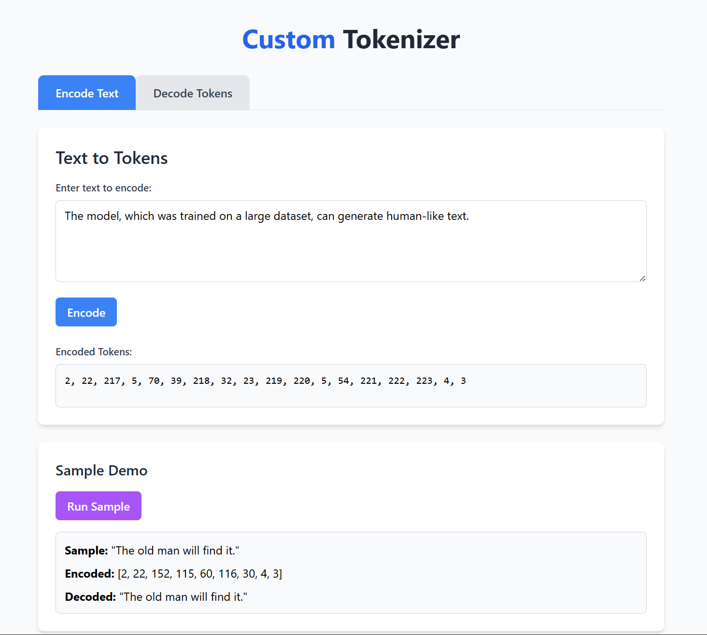
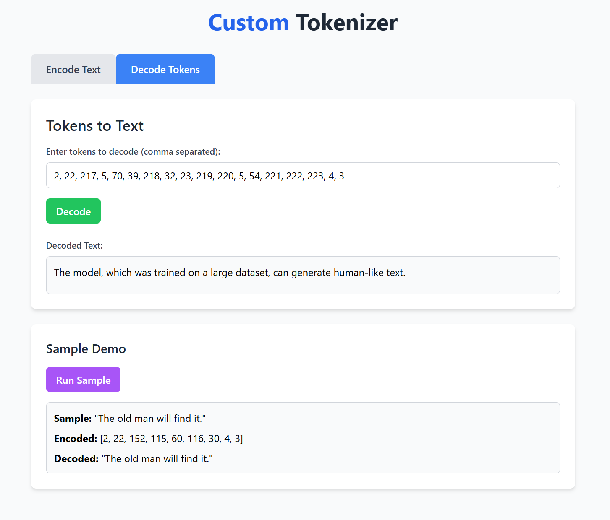

# Custom Tokenizer Demo

A simple Node.js project demonstrating a custom tokenizer for text processing, with a web interface to visualize tokenization results.

---

## 📦 Project Structure

```
Custom-Tokenizer/
├── main.js           # Tokenizer logic
├── server.js         # Express server for web demo
├── package.json      # Project dependencies and scripts
├── vocab.json        # Vocabulary for tokenization
└── views/
    └── index.ejs     # Web UI (EJS template)
```

---

## 🚀 Setup

1. **Clone the repository:**
   ```powershell
   git clone https://github.com/Maverick341/Custom-Tokenizer.git
   cd Custom-Tokenizer
   ```

2. **Install dependencies:**
   ```powershell
   npm install
   ```

3. **Start the server:**
   ```powershell
   npm run start
   ```

4. **Open your browser:**
   Visit [http://localhost:3000](http://localhost:3000)

---


## 🛠️ Usage

1. **Start the server** (see Setup above) and open [http://localhost:3000](http://localhost:3000) in your browser.

2. **Encode Text to Tokens:**
   - Select the "Encode Text" tab.
   - Enter any text in the input box (e.g., `The old man will find it.`).
   - Click the **Encode** button.
   - The encoded tokens will be displayed below the input.

3. **Decode Tokens to Text:**
   - Select the "Decode Tokens" tab.
   - Enter a comma-separated list of tokens (e.g., `2, 22, 152, 115, 60, 116, 30, 4, 3`).
   - Click the **Decode** button.
   - The decoded text will be shown below the input.

4. **Sample Demo:**
   - Use the **Run Sample** button in either tab to see a pre-filled example of encoding and decoding in action.

> The tokenizer uses a custom vocabulary defined in `vocab.json`. If a word is not in the vocabulary, it is assigned a new token ID dynamically during encoding.

> **Note:** This approach means that tokens for unknown words can only be decoded correctly within the same session. If you restart the server or use the tokens in another session, those dynamically assigned tokens may not be decodable back to the original words.

---

## 🖼️ Example Screenshots

### 1. Encoding Text
Here you can see the text being converted into tokens on the Encode tab.



### 2. Decoding Tokens
And here is the result of converting those tokens back to text on the Decode tab.



---


## 📚 Example

### Encode Example

**Input:**
```
The old man will find it.
```

**Encoded Output:**
```
2, 22, 152, 115, 60, 116, 30, 4, 3
```

### Decode Example

**Input:**
```
2, 22, 152, 115, 60, 116, 30, 4, 3
```

**Decoded Output:**
```
The old man will find it.
```

---

## 🤝 Contributing

Pull requests are welcome! For major changes, please open an issue first to discuss what you would like to change.

---

## 📄 License

This project is licensed under the MIT License
